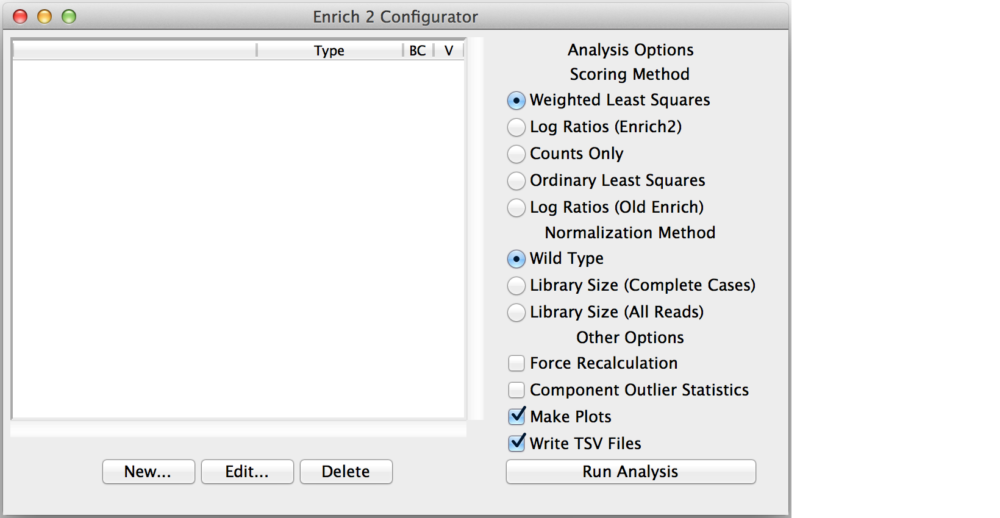
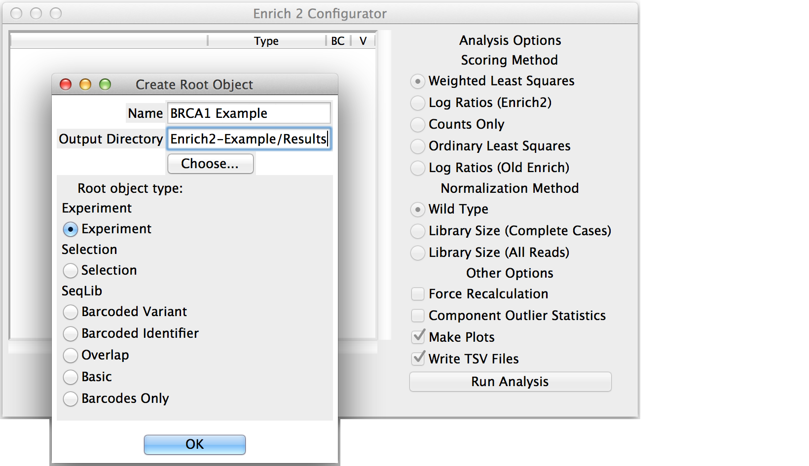
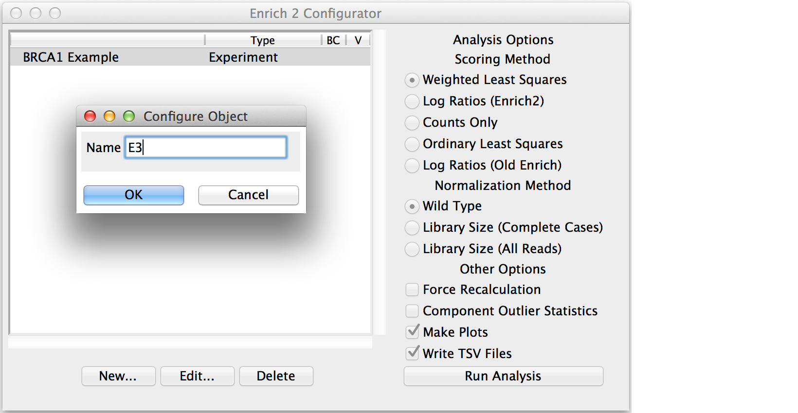
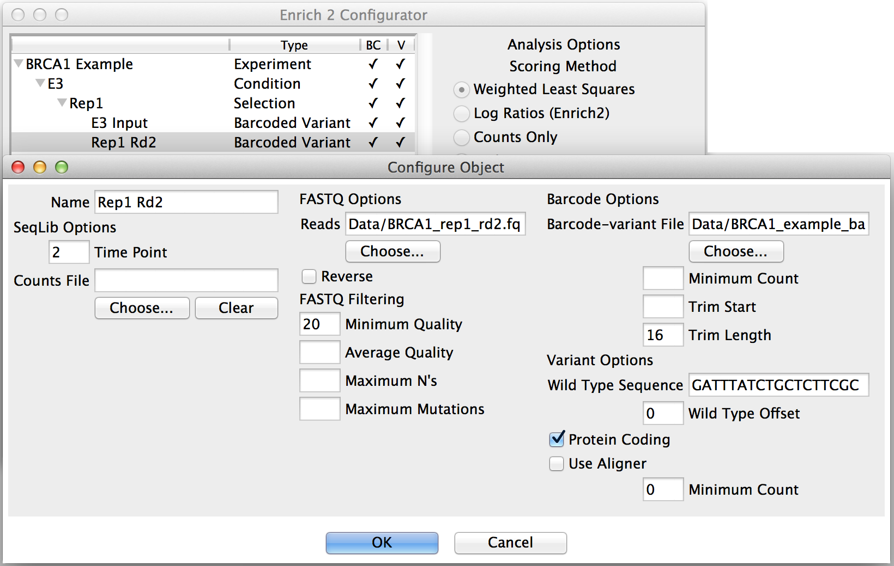
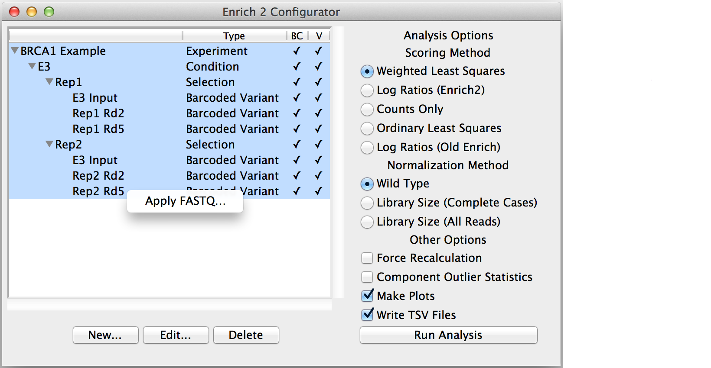

.. _gui-documentation:

Using the GUI
======================

The graphical user interface makes it easy to specify an experimental design that Enrich2 can understand. For more information about how these are organized, see :ref:`experimental-designs`.

Configuring your analysis
------------------------------------

The Enrich2 installer places the graphical user interface (GUI) entry point in your path. Type ``enrich_gui`` from the command line to launch the program. 

.. error:: Mac OS X users running the Enrich2 GUI in a virtualenv may encounter the following error::

        2016-10-10 12:34:56.789 python[12345:12345678] -[NSApplication _setup:]: unrecognized selector sent to instance 0x12345abcd

    This is caused by an interaction between Tkinter and the `matplotlib backend <http://matplotlib.org/faq/usage_faq.html#what-is-a-backend>`_. To fix the issue, edit (or create) the "~/.matplotlib/matplotlibrc" file and add the line::

        backend: TkAgg

.. note:: Once you have created your configuration file, you can also run the program in command line mode. Type ``enrich_cmd --help`` for usage and a list of command line options.

Click "New..." to create the root object.

Enter a short but descriptive object name that will not conflict with other objects in the analysis.

Choose the output directory for the HDF5_, plot, and tab-separated files generated by the analysis.

Select the appropriate object type: Experiment, Selection if there are no replicates, or SeqLib if you only want to count a single sequencing library.

If you created a Selection or Experiment root object, select it and click "New..." to add a child object.

Conditions and Selections do not have any parameters beyond their names.

Continue adding child objects until the entire experimental design is represented.
When creating a new SeqLib, choose the appropriate type depending on how the 
experiment was performed (see :ref:`intro-seqlibs`).

.. note:: To avoid re-counting the reads when multiple Selections share the same input library, use the same object name for the input library in each Selection.

Most parameters are specified in SeqLib objects, such as the wild type sequence, filtering options, and the location of the sequencing files or counts files (see :ref:`seqlib-configuration`).

.. note:: Time points can have multiple sequencing libraries, which are added together before scores are calculated.

Clicking "New..." with a SeqLib object selected will add a sibling SeqLib to the Selection that shares the same FASTQ_ filtering and other options.  

Saving and loading
---------------------------

After you have configured the analysis, you can save a configuration file by selecting "Save" or "Save As..." from the File menu. You can also use the File menu to load an existing configuration file by selecting "Open."

.. note:: If you encounter an error when loading a configuration file, try using a validator such as `JSONLint <http://jsonlint.com/>`_ to identify any issues. 

Context menus
---------------------------

Right-clicking on an object will open a context menu with additional actions not covered by the New/Edit/Delete buttons.

* Apply FASTQ...

	Copy the FASTQ_ filtering options from the chosen SeqLib to every highlighted SeqLib of the same type. 

.. _analysis-options:

Analysis options
---------------------

These choices are not saved in the configuration file and should be reviewed before running each analysis. For further information about the scoring and normalization methods below, see the `Enrich2 manuscript`_.

Scoring method
+++++++++++++++++++++++

* Weighted Least Squares

	Recommended for selections with at least three time points (including the input). 

* Log Ratios (Enrich2)
	
	 Recommended for selections with two time points (input and selected). For selections with more than two time points, the last time point is used as the selected time point. Intermediate time points not used.

* Counts Only

	No element scores are calculated. The output contains only element counts.

* Ordinary Least Squares

	Provided for comparison and legacy support.

* Log Ratios (Old Enrich)

	Provided for comparison and legacy support. This method is a re-implementation of the previously published `Enrich software <http://www.ncbi.nlm.nih.gov/pmc/articles/PMC3232369/>`_. Standard errors are not calculated. For selections with more than two time points, the last time point is used as the selected time point. Intermediate time points not used.

Normalization method
+++++++++++++++++++++++

* Wild Type

	Recommended if your selection has a wild type sequence. Normalizes counts by the wild type count as described in the `Enrich2 manuscript`_. For designs with identifiers instead of variants, the special wild type identifier "_wt" can be used.

* Library Size (Complete Cases)

	Normalizes counts by the library size. Only elements present in all time points within a selection contribute to the library size.

* Library Size (All Reads)

	Normalizes counts by the library size. All elements contribute to the library size.

Other options
+++++++++++++++++++++++

* Force Recalculation

	Discards all data that are not raw counts before performing the analysis. See :ref:`output-table-organization` for more about raw counts.

* Component Outlier Statistics

	Tests whether the score of each barcode differs significantly from that of its assigned variant or identifier. Performs an analogous calculation for variant and synonymous scores.

.. warning:: Testing for outliers is experimental and very computationally inefficient.

* Make Plots

	Creates plots for this analysis.

* Write TSV Files

	Outputs tab-separated files for this analysis.

Once you've finished selecting your options, click Run Analysis!

The output directory will contain :ref:`hdf5-files`, :ref:`plots`, and tab-separated files.

