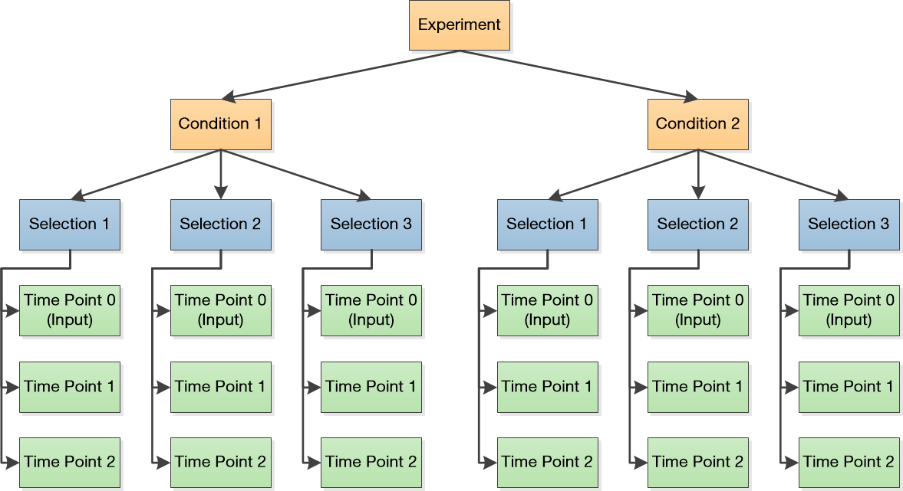

Defining experiments
=====================================================

.. _experimental-designs:

Experimental designs
-------------------------------------------------------

Enrich2 represents deep mutational scanning experimental designs as a tree of objects. The hierarchy of object types is defined below:

* Experiment

	The root object for most experimental designs. Parent of at least one experimental condition.

* Condition

	A single experimental condition. Parent of at least one replicate selection performed under the condition.

* Selection

	A single deep mutational scanning replicate. Parent of at least two sequencing libraries, one or more for each time point/round/bin of the selection.

* Sequencing library (SeqLib)

	FASTQ_ output or count data from a deep mutational scanning time point/round/bin. Has no children.

Each experimental design has a single root object, which can be an Experiment, Selection, or SeqLib. With the exception of Conditions, each experimental design object has its own HDF5 file containing its data. 

.. note:: Conditions do not have their own HDF5 file. If there is only one condition, use an Experiment as the root.

The above diagram illustrates an experimental design with two conditions, each with three replicates sampled at three time points (including the input).

.. _intro-elements:

Elements
-------------------------------------------------------

Enrich2 counts elements to quantify their enrichment or depletion in a complex population. The four element types are defined below:

* Barcode

	A short DNA barcode sequence often used for tagging variants. Stored as the barcode DNA sequence. Barcodes are counted directly from sequencing data.

* Variant
	
	A DNA-level variant of the wild type sequence, which can be coding or non-coding. Stored as an HGVS_ string describing the nucleotide and any amino acid differences from the wild type sequence. Variants can be counted either directly from sequencing data or as the sum of counts for linked barcodes as defined by a barcode-variant map.

* Synonymous

	A protein-level variant of the wild type sequence. Stored as an HGVS_ string describing the amino acid differences from the wild type sequence. Synonymous elements are counted as the sum of counts for variant elements with the same amino acid sequence. Variant elements with the wild type amino acid sequence but a non-wild type DNA sequence are assigned to a special variant.

* Identifier

	An arbitrary label (such as a target gene name) for barcode assignment. Stored as the label string. Identifiers are counted as the sum of counts for associated barcodes as defined by a barcode-identifier map or specified as counts.

.. _intro-seqlibs:

SeqLibs
-------------------------------------------------------

Enrich2 implements five types of SeqLib, each supporting different element types and/or methods of sequencing deep mutational scanning populations.

.. note:: Synonymous elements are only present if the wild type sequence is protein coding.

* Barcoded Variant

	Contains barcode, variant, and synonymous elements.	Each DNA variant in the experiment is linked to one or more DNA barcode sequences. A barcode-variant map describes which barcodes map to each variant. The FASTQ_ file contains only barcode sequences.

* Barcoded Identifier
	
	Contains barcode and identifier elements. Each identifier in the experiment is associated with one or more DNA barcode sequences. A barcode-identifier map describes which barcodes map to each identifier. The FASTQ_ file contains only barcode sequences.

* Overlap

	Contains variant and synonymous elements. DNA variants are sequenced directly using overlapping paired-end reads. Requires FASTQ_ files for both forward and reverse reads.

* Basic
	
	Contains variant and synonymous elements. DNA variants are sequenced directly using single-end reads.

* Barcodes Only

	Contains barcode elements. The FASTQ_ file contains only barcode sequences.

* Identifiers Only

	Contains identifier elements. No FASTQ_ file is processed, so the counts must be provided by the user.

For more information, see :ref:`seqlib-configuration`.

